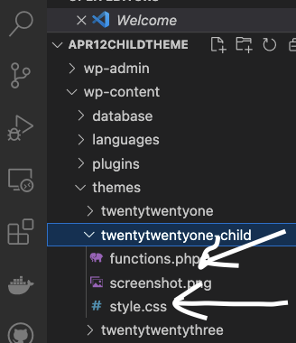
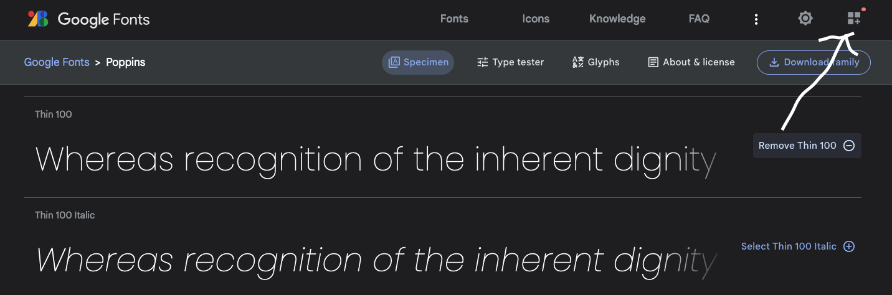
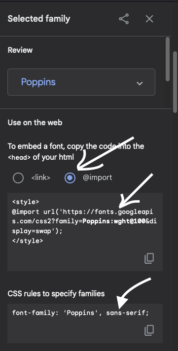
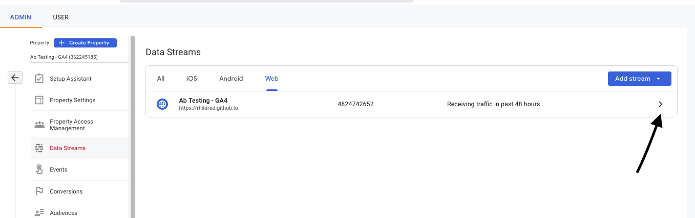
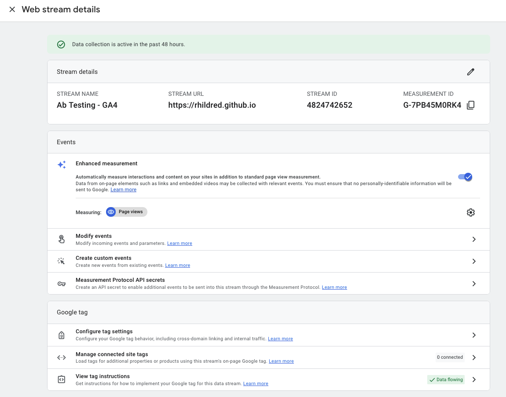
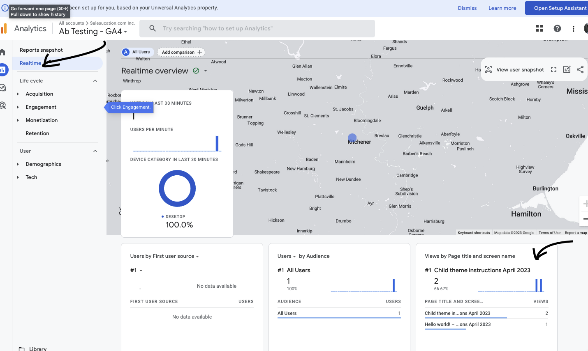

# UX221 Sample Theme 2023

This is a child theme that covers:

1. A root element and imported font in style.css
2. An added class name (`.assignment2-class`) to make css more specific in functions.php
3. Add G4 google analytics code in functions.php
4. Add favicon in theme in functions.php

To use this:

1. Download as .zip from github
2. Add theme
3. upload from .zip

You will want to make this your own by:

1. editing the functions.php and style.css in the child theme

2. importing a font of your choice

3. Add rules to consume the font and set up colors
4. Getting your config id

5. View/test your analytics in real time mode

